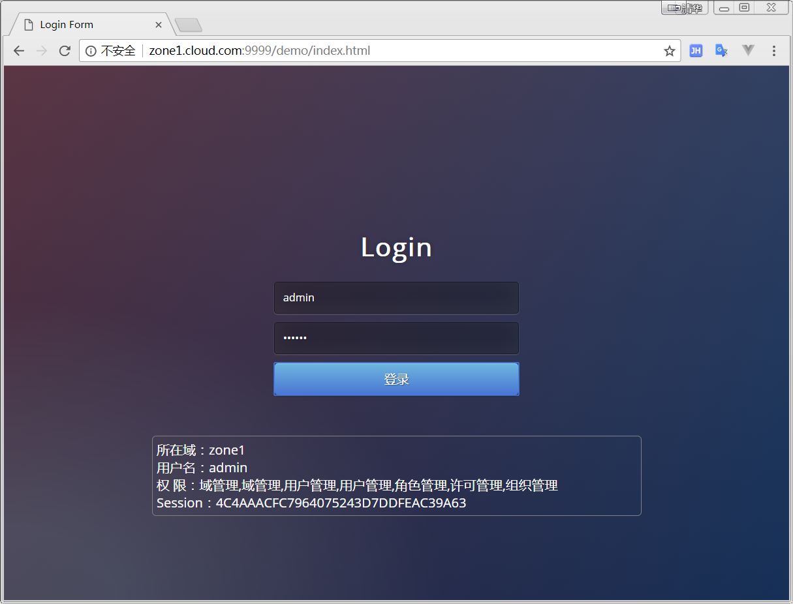
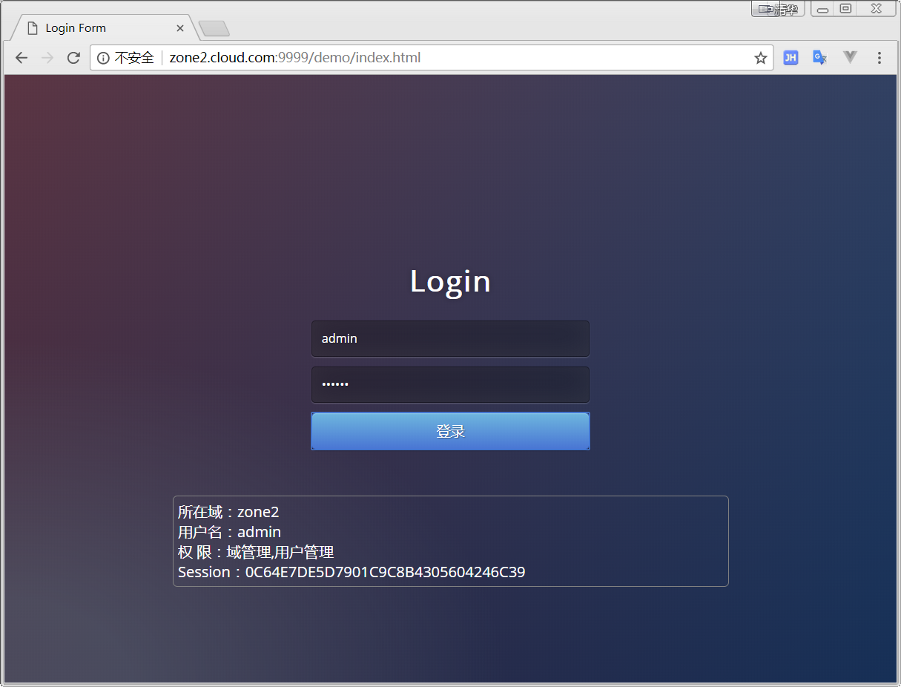

## 授权服务使用后台示例

 1. 运行
 ```
mvn spring-boot:run 
 ```
 2. swagger api
http://localhost:9999/demo/swagger-ui.html

## 不同二级域名情况下，同名用户登录测试
 1. 不同的域在hosts设置（这儿仅为测试为目的，实际部署时要通过DNS）
 ```
 127.0.0.1	zone1.cloud.com
 127.0.0.1	zone2.cloud.com
 ```
 2. 不同二级域名情况下，同名用户登录测试
 - http://zone1.cloud.com:9999/demo/index.html
   
 - http://zone2.cloud.com:9999/demo/index.html
   